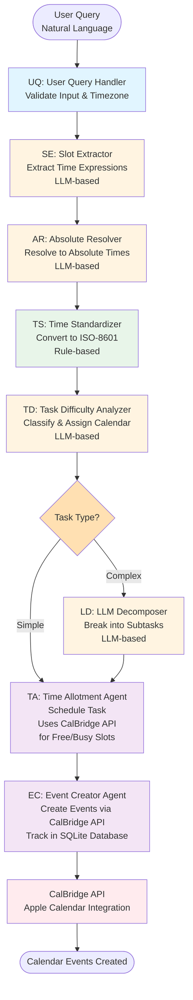

# CalBridge — Intelligent Calendar Assistant

**CalBridge** is a powerful macOS application that bridges the gap between natural language task planning and your Apple Calendar. It combines a local HTTP API for calendar access with an intelligent **multi-agent system** that understands your tasks and automatically schedules them into your calendar.

## What CalBridge Does

- **Handles Calendar Permissions**: Owns macOS Calendar access so your applications don't need TCC (Transparency, Consent, and Control) permissions
- **Multi-Agent System**: Orchestrates 8 specialized agents working together to process natural language, extract time information, classify tasks, decompose complex projects, and schedule events
- **Natural Language Processing**: Processes queries like "Call mom tomorrow at 2pm" or "Plan a 5-day Japan trip by Nov 15" and automatically creates calendar events
- **Smart Calendar Assignment**: Automatically assigns tasks to Work or Home calendars based on task type using LLM-based classification
- **Complex Task Breakdown**: Decomposes complex projects into manageable subtasks and schedules them optimally using intelligent decomposition
- **RESTful API**: Exposes a clean HTTP API for programmatic calendar access from any application

Built with **FastAPI**, **PyObjC**, and powered by **Ollama** for LLM-based natural language understanding. The multi-agent architecture enables modular, testable, and extensible task processing.

---

## Repository Structure

```
calendar-test/
├── helper_app.py              # FastAPI + EventKit (CalBridge core)
├── setup.py                   # py2app configuration for macOS app bundle
├── requirements.txt           # Python dependencies
├── config/
│   └── calendars.json         # Cached calendar data
├── agents/                    # Intelligent task scheduling agents
│   ├── app.py                # Main CLI application (8-stage pipeline)
│   ├── user_query.py          # User Query Handler (UQ)
│   ├── slot_extractor.py      # Slot Extractor (SE) - LLM-based
│   ├── absolute_resolver.py   # Absolute Resolver (AR) - LLM-based
│   ├── time_standardizer.py   # Time Standardizer (TS) - Rule-based
│   ├── task_difficulty_analyzer.py  # Task Difficulty Analyzer (TD) - LLM-based
│   ├── llm_decomposer.py      # LLM Decomposer (LD) - LLM-based
│   ├── time_allotment_agent.py # Time Allotment Agent (TA)
│   ├── event_creator_agent.py # Event Creator Agent (EC)
│   ├── event_creator.db       # SQLite database for event tracking
│   ├── README.md              # Detailed agents documentation
│   ├── QUICK_START.md         # Quick start guide
│   └── test/                  # Test suite
├── agent-rules/               # Agent prompt rules and configurations
├── task_scheduler/            # Core scheduling algorithm
└── build/ & dist/             # Build artifacts (CalBridge.app)
```

---

## Prerequisites

* macOS (Apple Calendar installed)
* Python 3.11+ (works with your `.venv`)
* Tools: `pip`, `py2app`, `pyobjc`, `fastapi`, `uvicorn`, `pydantic`
* Ollama (for LLM-based agents) - see [agents/README.md](agents/README.md) for details

Create/activate a virtualenv:

```bash
python3 -m venv .venv
source .venv/bin/activate
python -m pip install --upgrade pip
```

Install dependencies:

```bash
pip install -r requirements.txt
```

---

## Starting CalBridge

### Development Build (Recommended)

Uses your source files directly (no need to rebuild on every code change).

```bash
# from project root
rm -rf build dist
python setup.py py2app -A
./dist/CalBridge.app/Contents/MacOS/CalBridge
```

You should see logs:

```
Calendar access: True/False
CalBridge listening on http://127.0.0.1:8765 ...
INFO:     Uvicorn running on http://127.0.0.1:8765
```

### Production Build

```bash
rm -rf build dist
python setup.py py2app
open dist/CalBridge.app
```

> Note: When launched via Finder, stdout is hidden. To see logs:
> ```bash
> ./dist/CalBridge.app/Contents/MacOS/CalBridge
> ```

---

## CalBridge API Endpoints

**Base URL (default):** `http://127.0.0.1:8765`

### Status & Calendars

* `GET /status` → `{"authorized": true/false, "status_code": <int>}`
* `GET /calendars` → List calendars with `id`, `title`, `allows_modifications`, `color_hex`

### Events

* `GET /events?days=7` - List upcoming events
  - Optional query params: `calendar_id`, `calendar_title`, `exclude_holidays=true`, `all_day_only=true`, `non_all_day_only=true`

### Event Management

* `POST /add` (JSON) - Create calendar event

  ```json
  {
    "title": "Title",
    "start_iso": "2025-10-03T10:00:00-04:00",
    "end_iso": "2025-10-03T10:45:00-04:00",
    "notes": "optional",
    "calendar_id": "…",          // preferred
    "calendar_title": "Home"      // fallback
  }
  ```

  Returns: `{ id, title, start_iso, end_iso, calendar }`

* `POST /delete?event_id=…` → `{ "deleted": true/false }`

### Quick Test

```bash
curl -s http://127.0.0.1:8765/status
curl -s http://127.0.0.1:8765/calendars
curl -s "http://127.0.0.1:8765/events?days=3"
```

---

## Agents: Intelligent Task Scheduling

The `agents/` folder contains an 8-stage pipeline that processes natural language queries and automatically schedules tasks into your calendar. See [agents/README.md](agents/README.md) for detailed documentation.

### Quick Start

```bash
cd /Users/zubair/Desktop/Dev/calendar-test
source .venv/bin/activate
python agents/app.py "Call mom tomorrow at 2pm for 30 minutes"
```

### Pipeline Flow

The agents system processes queries through 8 stages:

1. **UQ (User Query Handler)**: Validates input and sets timezone
2. **SE (Slot Extractor)**: LLM-based extraction of time expressions from natural language
3. **AR (Absolute Resolver)**: LLM-based resolution of relative time to absolute dates/times
4. **TS (Time Standardizer)**: Rule-based conversion to ISO-8601 format
5. **TD (Task Difficulty Analyzer)**: LLM-based classification (simple/complex) and calendar assignment
6. **LD (LLM Decomposer)**: LLM-based decomposition of complex tasks into 2-5 subtasks (only for complex tasks)
7. **TA (Time Allotment Agent)**: Schedules tasks into available calendar slots using optimization algorithm
8. **EC (Event Creator Agent)**: Creates calendar events via CalBridge API and tracks them in SQLite database

#### Pipeline Flowchart



### Example: Simple Task

**Input:**
```bash
python agents/app.py "Call dentist tomorrow at 10am for 45 minutes"
```

**Output:**
- Creates 1 calendar event in the appropriate calendar (Work/Home)
- Event scheduled at the specified time
- Task ID and calendar event ID tracked in database

**Example Output:**
```
🚀 AGENTS - FULL PIPELINE
================================================================================
📝 Query: Call dentist tomorrow at 10am for 45 minutes
🌍 Timezone: America/New_York

STEP 1: User Query Handler (UQ)
================================================================================
✅ Query validated

STEP 2: Slot Extractor (SE)
================================================================================
✅ Time information extracted
  • start_text: tomorrow at 10am
  • duration: 45 minutes

STEP 3: Absolute Resolver (AR)
================================================================================
✅ Time resolved to absolute values
  • start_text: October 14, 2025 10:00 am
  • end_text: October 14, 2025 10:45 am

STEP 4: Time Standardizer (TS)
================================================================================
✅ Converted to ISO format
  • start: 2025-10-14T10:00:00-04:00
  • end: 2025-10-14T10:45:00-04:00
  • duration: PT45M

STEP 5: Task Difficulty Analyzer (TD)
================================================================================
✅ Task classified
  • type: simple
  • calendar: Home
  • title: Call dentist

STEP 6: LLM Decomposer (LD)
================================================================================
ℹ️  Skipped (simple task)

STEP 7: Time Allotment Agent (TA)
================================================================================
✅ Task scheduled
  • slot: [2025-10-14T10:00:00-04:00, 2025-10-14T10:45:00-04:00]
  • task_id: <uuid>

STEP 8: Event Creator Agent (EC)
================================================================================
✅ Calendar event created
  • calendar_event_id: <uuid>
  • calendar: Home

✅ Pipeline completed successfully!
```

### Example: Complex Task

**Input:**
```bash
python agents/app.py "Plan a 5-day Japan trip by Nov 15"
```

**Output:**
- Decomposes into 2-5 subtasks (e.g., "Research destinations", "Book flights", "Book hotels", "Create itinerary")
- Each subtask scheduled into available calendar slots
- Parent-child relationships maintained in database
- All events created in appropriate calendar (Work/Home)

**Example Output:**
```
🚀 AGENTS - FULL PIPELINE
================================================================================
📝 Query: Plan a 5-day Japan trip by Nov 15
🌍 Timezone: America/New_York

[... pipeline steps ...]

STEP 5: Task Difficulty Analyzer (TD)
================================================================================
✅ Task classified
  • type: complex
  • calendar: Home
  • title: Plan 5-day Japan trip

STEP 6: LLM Decomposer (LD)
================================================================================
✅ Task decomposed into 4 subtasks
  • Research must-see cities (Japan trip) - PT1H
  • Compare flights and book (Japan trip) - PT1H30M
  • Book hotels (Japan trip) - PT2H
  • Create day-by-day itinerary (Japan trip) - PT1H30M

STEP 7: Time Allotment Agent (TA)
================================================================================
✅ Complex task scheduled
  • parent_id: <uuid>
  • 4 subtasks scheduled into available slots

STEP 8: Event Creator Agent (EC)
================================================================================
✅ Calendar events created
  • 4 events created
  • All linked to parent task

✅ Pipeline completed successfully!
```

### Interactive Mode

```bash
python agents/app.py --interactive
```

### List & Manage Events

```bash
# List all events
python agents/app.py --list

# Delete a task by ID
python agents/app.py --delete <task_id>

# Delete all children of a parent task
python agents/app.py --delete-parent <parent_id>

# Delete all events (requires confirmation)
python agents/app.py --delete-all
```

For more details, see [agents/README.md](agents/README.md) and [agents/QUICK_START.md](agents/QUICK_START.md).

### Task Scheduling Strategy

The Time Allotment Agent (TA) uses an **ordered even-spread scheduling algorithm** to intelligently place tasks into available calendar slots. The strategy balances multiple objectives:

**Key Features:**

- **Even Distribution**: Tasks are spread evenly across available days to avoid clustering
- **Order Preservation**: Maintains the original task order (important for complex tasks with dependencies)
- **Anti-Bunching**: Prefers days with fewer scheduled tasks to prevent overload
- **Constraint-Aware**: Respects work windows (6 AM–11 PM), blackouts, minimum gaps, and maximum tasks per day
- **Greedy Heuristic**: Fast, practical algorithm that produces human-sensible schedules

**How It Works:**

1. **Availability Normalization**: Fetches free/busy slots from CalBridge API, splits at midnight, and clips to work window
2. **Feasibility Check**: Verifies total available time meets task requirements before scheduling
3. **Even-Spread Targets**: Computes target day indices to distribute tasks uniformly across available days
4. **Greedy Placement**: For each task (in order):
   - Ranks days by proximity to target index and current task load
   - Selects the earliest feasible time slot on the chosen day
   - Applies cooldown gaps and respects daily limits
5. **Validation**: Ensures all tasks are placed before deadline with clear error messages if infeasible

This approach ensures tasks are scheduled efficiently while respecting calendar constraints and maintaining a balanced workload distribution.

---

## Technical Stack

### CalBridge Core
- **FastAPI**: Modern, fast web framework for building the REST API
- **Uvicorn**: ASGI server for running FastAPI
- **PyObjC**: Python bindings for Objective-C, enabling EventKit integration
- **EventKit**: Apple's framework for calendar access
- **py2app**: Python to macOS application bundle converter
- **Pydantic**: Data validation using Python type annotations

### Agents System
- **Ollama**: Local LLM server (Qwen2.5:14b-instruct model)
- **SQLite**: Database for tracking tasks and calendar event mappings
- **Task Scheduler**: Optimization algorithm for scheduling tasks into available slots
- **ISO-8601**: Standard time format throughout the pipeline
- **LangGraph-inspired**: Agent orchestration pattern

### Architecture
- **Microservices**: CalBridge (API) + Agents (Processing)
- **Event-Driven**: Agents respond to natural language queries
- **Database**: SQLite for event tracking and task relationships
- **API-First**: All calendar operations via HTTP REST API

---

## What Has Been Achieved

✅ **CalBridge**: Complete macOS app with Calendar permissions, FastAPI REST API  
✅ **8-Stage Agent Pipeline**: Full natural language to calendar event pipeline  
✅ **Simple Task Scheduling**: Direct scheduling of single tasks with time constraints  
✅ **Complex Task Decomposition**: LLM-based breakdown of complex tasks into subtasks  
✅ **Intelligent Calendar Assignment**: Automatic Work/Home calendar assignment  
✅ **Time Resolution**: Robust handling of relative time expressions ("tomorrow", "next Friday", etc.)  
✅ **Event Tracking**: SQLite database tracks all tasks and calendar event mappings  
✅ **Task Management**: List, delete, and manage scheduled events  
✅ **Timezone Support**: Full timezone awareness throughout the pipeline  

---

## Future Work

🔲 **Memory System**: User personalization for time constraints - learns from user preferences and past scheduling patterns  
🔲 **File Upload Functionality**: Multimodal input support for files, audio, and images to extract tasks from various sources  

---

## Permissions (TCC)

* Calendar permission is **per-app/binary**. Grant it to **CalBridge.app** once; it persists.
* First run should show a system dialog. If not:

Open: **System Settings → Privacy & Security → Calendars**  
Ensure **CalBridge** is listed and toggled **On**.

Reset (if needed):

```bash
# resets Calendar permission for the app bundle id in setup.py
tccutil reset Calendar dev.zubair.CalBridge
```

---

## Troubleshooting

**A) Port already in use**

```bash
lsof -nP -iTCP:8765 -sTCP:LISTEN
kill <PID>        # or: kill -9 <PID>
pkill -f CalBridge
```

**B) App already running**

* Quit from Dock (right-click → Quit) or:
```bash
pkill -f CalBridge
```

**C) No permission dialog / unauthorized**

* Ensure you're launching the **app bundle** (not just `python helper_app.py`).
* Check **System Settings → Privacy & Security → Calendars** (toggle **CalBridge** on).
* Reset (if stuck):
```bash
tccutil reset Calendar dev.zubair.CalBridge
open dist/CalBridge.app
```

**D) Agents not working**

* Ensure CalBridge is running: `curl http://127.0.0.1:8765/status`
* Ensure Ollama is running: `curl http://localhost:11434/api/tags`
* Check [agents/README.md](agents/README.md) for detailed troubleshooting

**E) Uvicorn not bundled**

* Ensure these are included in `setup.py`:
  ```python
  'packages': ['fastapi','starlette','uvicorn','pydantic','anyio','sniffio','h11'],
  'includes': ['EventKit','Foundation','AppKit'],
  ```
* Rebuild clean: `rm -rf build dist && python setup.py py2app`

---

## Design Notes

* Main thread keeps the **Cocoa run loop** alive (EventKit needs it).
* **Uvicorn** runs in a background thread serving HTTP on localhost.
* All Calendar I/O happens inside the authorized app → client code (agents/notebook) remains simple and permission-free.
* Agents pipeline is modular and extensible - each stage can be tested independently.

---

## Safety / Idempotency Tip

When creating events, include your own identifiers in `notes` (e.g., `t:task_123 s:sub_a v:1`). If anything gets out of sync, you can reconcile by listing `/events` and matching those tokens.
