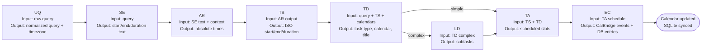

# Agents System

A multi-agent system that processes natural language queries through an 8-stage pipeline to automatically schedule tasks in your calendar.

## Overview

The agents system transforms natural language like "Call mom tomorrow at 2pm" into scheduled calendar events. It uses a combination of LLM-based agents and rule-based processors to understand, classify, and schedule tasks.

## Quick Start

```bash
# From project root
source .venv/bin/activate
python agents/app.py "Call mom tomorrow at 2pm for 30 minutes"
```

For more examples and usage, see [QUICK_START.md](QUICK_START.md) and [APP_README.md](APP_README.md).

## Pipeline Components

The system consists of 8 specialized agents working together:

| Agent | Purpose | Type |
|-------|---------|------|
| **UQ** - User Query Handler | Validates input and sets timezone | Rule-based |
| **SE** - Slot Extractor | Extracts time expressions from natural language | LLM-based |
| **AR** - Absolute Resolver | Resolves relative time to absolute dates/times | LLM-based |
| **TS** - Time Standardizer | Converts to ISO-8601 format | Rule-based |
| **TD** - Task Difficulty Analyzer | Classifies task (simple/complex) and assigns calendar | LLM-based |
| **LD** - LLM Decomposer | Decomposes complex tasks into 2-5 subtasks | LLM-based |
| **TA** - Time Allotment Agent | Schedules tasks into available calendar slots | Optimization |
| **EC** - Event Creator Agent | Creates calendar events via CalBridge API | API Integration |

## Agent Details (Inputs & Outputs)

Each agent has a clearly defined contract. Detailed prompts/rules live in `agent-rules/`.

### 1. UQ — User Query Handler (`user_query.py`)
- **Input:** Raw natural language query, optional `--timezone`
- **Output:** Normalized query string plus resolved timezone (IANA format)
- **Notes:** Guards against empty queries and enforces basic validation

### 2. SE — Slot Extractor (`slot_extractor.py`, rules: `agent-rules/2_slot_extractor.txt`)
- **Input:** Normalized query + timezone from UQ
- **Output:** `start_text`, `end_text`, `duration` strings (may be `null`)
- **Notes:** LLM (Ollama/Qwen2.5:14b) extracts raw time expressions without anchoring

### 3. AR — Absolute Resolver (`absolute_resolver.py`, rules: `agent-rules/3_absolute_resolver*.txt`)
- **Input:** Slot Extractor output + contextual timestamps (`NOW_ISO`, day/week/month helpers)
- **Output:** Absolute `start_text`, `end_text`, `duration` in canonical human-readable format
- **Notes:** Converts relative phrases (“next Tuesday”) into concrete datetimes

### 4. TS — Time Standardizer (`time_standardizer.py`)
- **Input:** Absolute Resolver output
- **Output:** ISO-8601 `start`, `end`, `duration`
- **Notes:** Rule-based parser that enforces timezone awareness and duration sanity checks

### 5. TD — Task Difficulty Analyzer (`task_difficulty_analyzer.py`, rules: `agent-rules/5_task_difficulty_analyzer.txt`)
- **Input:** User query, TS output, calendar metadata from CalBridge
- **Output:** Task classification (`simple`/`complex`), calendar assignment, cleaned title, preserved duration
- **Notes:** Also decides whether LD should run

### 6. LD — LLM Decomposer (`llm_decomposer.py`, rules: `agent-rules/6_llm_decomposer.txt`)
- **Input:** TD output when `type=complex`
- **Output:** 2–5 subtasks with titles, durations (≤ PT3H), and parent metadata
- **Notes:** Ensures subtasks remain schedulable and inherit TD metadata

### 7. TA — Time Allotment Agent (`time_allotment_agent.py`, rules: `agent-rules/7_time_allotment.txt`)
- **Input:** TS window + TD (simple) or LD (complex) payload
- **Output:** Scheduled tasks/subtasks with concrete time slots and UUIDs
- **Notes:** Uses ordered even-spread scheduler + CalBridge free/busy data; enforces constraints (work window, min gaps, max tasks/day)

### 8. EC — Event Creator Agent (`event_creator_agent.py`, rules: `agent-rules/8_event_creator.txt`)
- **Input:** TA schedule plus CalBridge credentials
- **Output:** Calendar events created via CalBridge API, persisted mappings in `event_creator.db`
- **Notes:** Supports list/delete operations and keeps parent-child relationships synchronized

## Agent Flowchart



### How It Works

1. **UQ** validates your query and sets the timezone
2. **SE** extracts time expressions ("tomorrow at 2pm", "30 minutes")
3. **AR** resolves relative times to absolute dates ("October 14, 2025 2:00 PM")
4. **TS** standardizes to ISO-8601 format
5. **TD** classifies the task as simple or complex and assigns Work/Home calendar
6. **LD** (if complex) breaks down into manageable subtasks
7. **TA** schedules tasks into available calendar slots using CalBridge API
8. **EC** creates calendar events and tracks them in SQLite database

## Usage

### Basic Usage

```bash
python agents/app.py "Your natural language query"
```

### Interactive Mode

```bash
python agents/app.py --interactive
```

### List All Events

```bash
python agents/app.py --list
```

### Delete Events

```bash
# Delete a specific task
python agents/app.py --delete <task_id>

# Delete all children of a parent task
python agents/app.py --delete-parent <parent_id>

# Delete all events (requires confirmation)
python agents/app.py --delete-all
```

## Configuration

- **LLM**: Ollama with Qwen2.5:14b-instruct
- **Timezone**: Default `America/New_York` (configurable via `--timezone`)
- **CalBridge API**: Default `http://127.0.0.1:8765`
- **Database**: SQLite (`event_creator.db`)

## Database

The Event Creator Agent uses SQLite to track tasks and calendar events:

- **Tasks Table**: Task IDs, titles, and parent-child relationships
- **Event Map Table**: Maps task IDs to calendar event IDs

All delete operations remove events from both the calendar (via CalBridge) and the database.

## Testing

For development and testing, see the `test/` directory. Test files are organized by component and pipeline stage.

**Note**: Most users should use `agents/app.py` directly. The test files are for development and debugging.

## Requirements

See `requirements.txt` for Python dependencies. Requires:
- Python 3.11+
- Ollama running locally
- CalBridge API running (`http://127.0.0.1:8765`)

## Documentation

- **[QUICK_START.md](QUICK_START.md)**: Quick examples and common use cases
- **[APP_README.md](APP_README.md)**: Complete CLI reference and detailed examples
- **[Time_Allotment/README.md](Time_Allotment/README.md)**: Time Allotment Agent details
