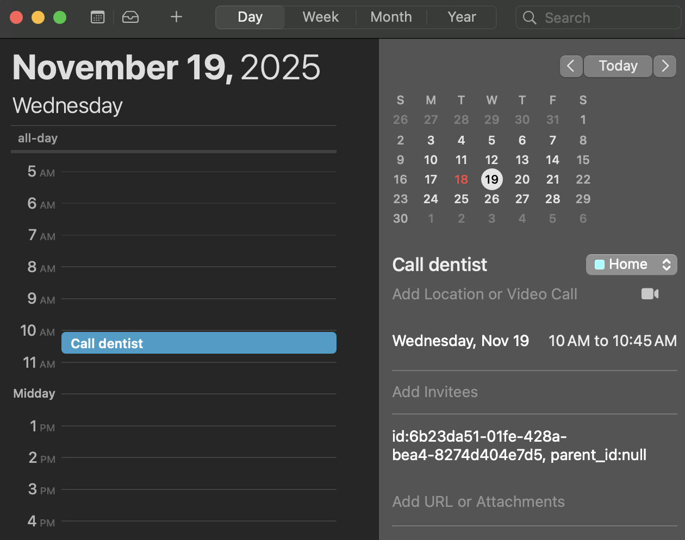
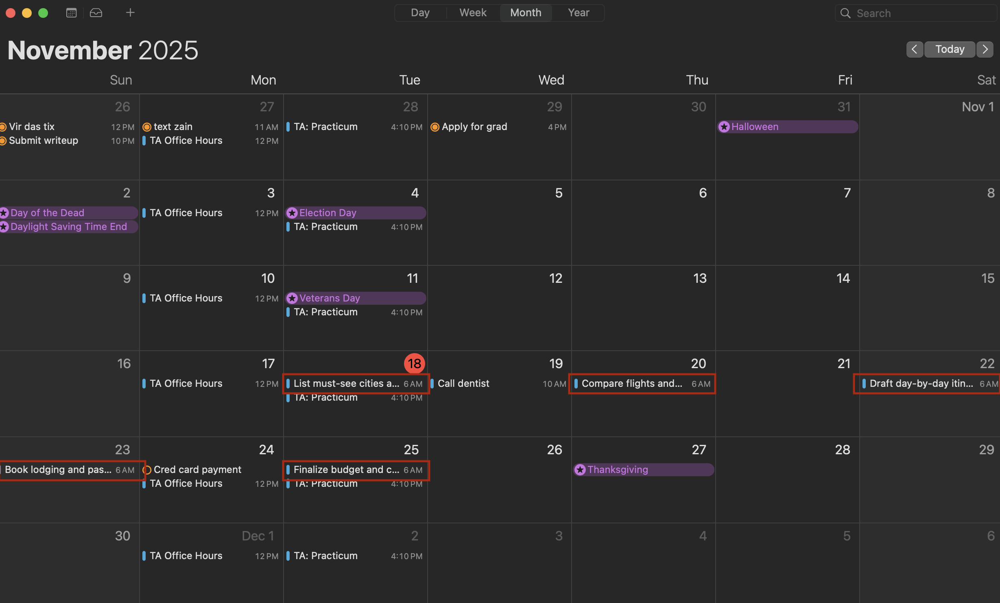
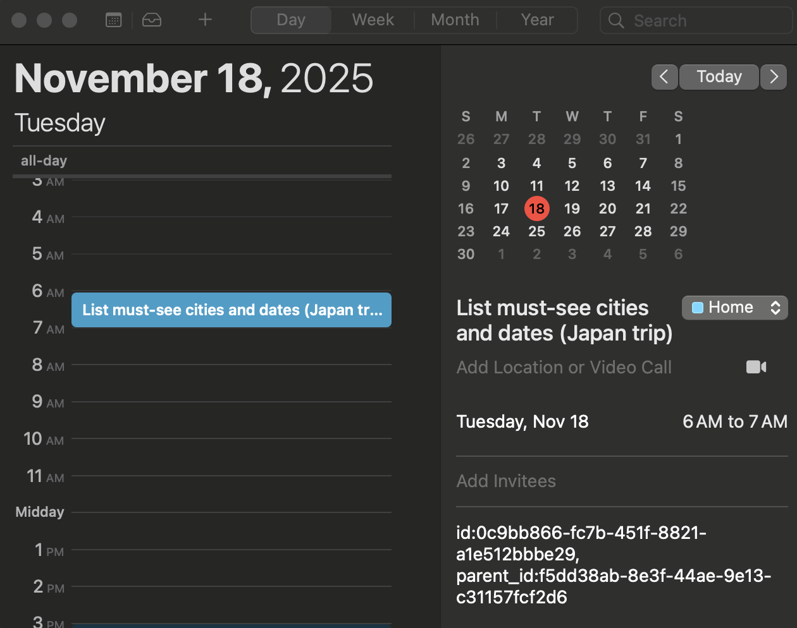
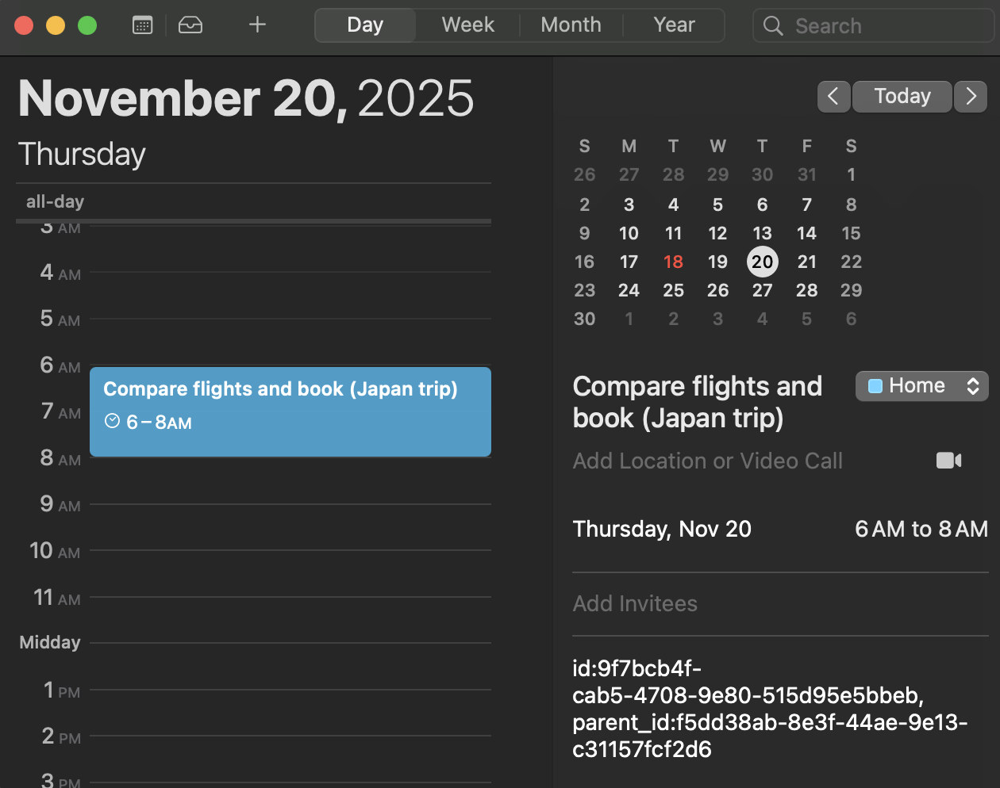
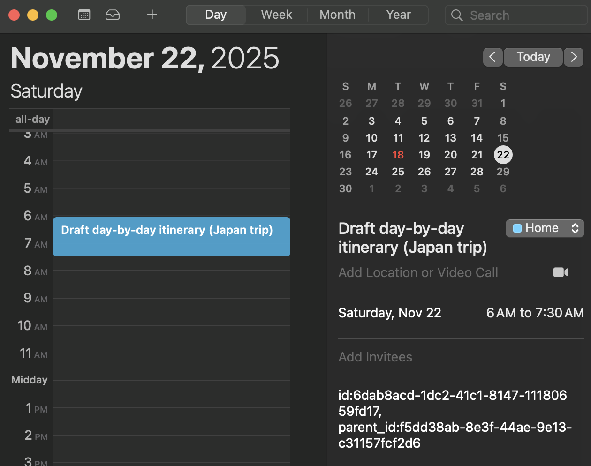
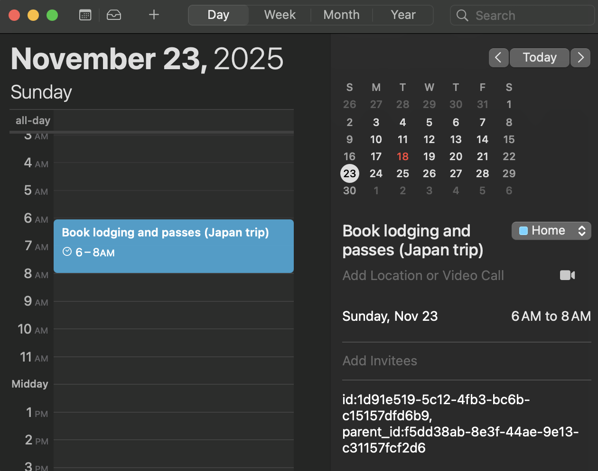
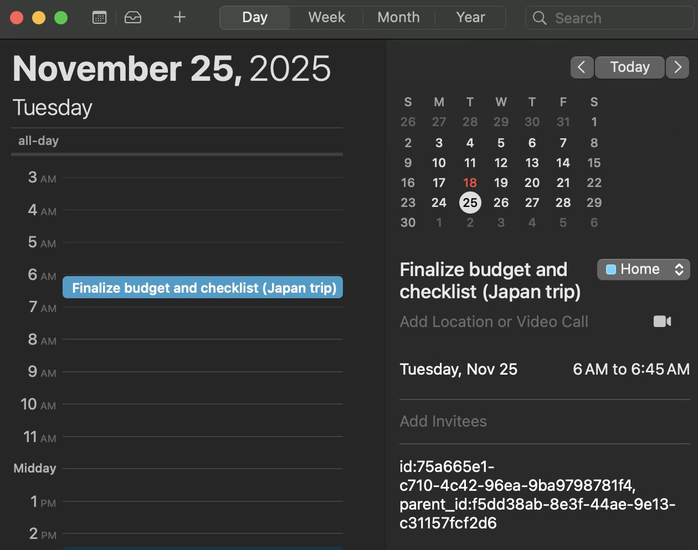

# Examples

This folder contains real-world examples demonstrating how CalBridge processes simple and complex tasks through the 8-stage agent pipeline.

---

## Simple Task Example

**Query:** `"Call dentist tomorrow at 10am for 45 minutes"`

This example demonstrates how a simple, single-duration task is processed and scheduled.

### Pipeline Output

```
================================================================================
🚀 STREAMLINED AGENTS - FULL PIPELINE
================================================================================
📝 Query: Call dentist tomorrow at 10am for 45 minutes
🌍 Timezone: America/New_York

STEP 1: User Query Handler (UQ)
✅ Query validated

STEP 2: Slot Extractor (SE)
✅ Time slots extracted
  • start_text: tomorrow at 10am
  • duration: 45 minutes

STEP 3: Absolute Resolver (AR)
✅ Absolute times resolved
  • start_text: November 19, 2025 10:00 am
  • end_text: November 19, 2025 11:59 pm
  • duration: 45 minutes

STEP 4: Time Standardizer (TS)
✅ Times standardized to ISO format
  • start: 2025-11-19T10:00:00-05:00
  • end: 2025-11-19T23:59:59-05:00
  • duration: PT45M

STEP 5: Task Difficulty Analyzer (TD)
✅ Task classified
  • calendar: E198547B-614F-4109-B61A-96C56D4DED8A
  • type: simple
  • title: Call dentist
  • duration: PT45M

STEP 6: LLM Decomposer (LD)
ℹ️  Skipped (simple task)

STEP 7: Time Allotment Agent (TA)
✅ Simple task scheduled
  🆔 Task ID: 6b23da51-01fe-428a-bea4-8274d404e7d5
  ⏰ Slot: 2025-11-19T10:00:00-05:00 → 2025-11-19T10:45:00-05:00

STEP 8: Event Creator Agent (EC)
✅ Simple task event created
  🆔 Task ID: 6b23da51-01fe-428a-bea4-8274d404e7d5
  📅 Calendar Event ID: 4F727578-102E-4B4E-B057-C168E5CBB905

🎉 SUCCESS: Calendar events created!
```

### Calendar Event



**What happened:**
- The system extracted "tomorrow at 10am" and "45 minutes" from the natural language query
- Resolved "tomorrow" to the absolute date (November 19, 2025)
- Classified the task as "simple" (single event, no decomposition needed)
- Scheduled the event at the specified time (10:00 AM - 10:45 AM)
- Created a calendar event in the Home calendar

---

## Complex Task Example

**Query:** `"Plan a 5-day Japan trip by Nov 25"`

This example demonstrates how a complex, multi-step project is decomposed into subtasks and scheduled across multiple days.

### Pipeline Output

```
================================================================================
🚀 STREAMLINED AGENTS - FULL PIPELINE
================================================================================
📝 Query: Plan a 5-day Japan trip by Nov 25
🌍 Timezone: America/New_York

STEP 1: User Query Handler (UQ)
✅ Query validated

STEP 2: Slot Extractor (SE)
✅ Time slots extracted
  • end_text: Nov 25
  • duration: None

STEP 3: Absolute Resolver (AR)
✅ Absolute times resolved
  • start_text: November 18, 2025 12:08 am
  • end_text: November 25, 2025 11:59 pm

STEP 4: Time Standardizer (TS)
✅ Times standardized to ISO format
  • start: 2025-11-18T01:08:55.959346-05:00
  • end: 2025-11-25T23:59:59-05:00

STEP 5: Task Difficulty Analyzer (TD)
✅ Task classified
  • calendar: E198547B-614F-4109-B61A-96C56D4DED8A
  • type: complex
  • title: Plan Japan trip

STEP 6: LLM Decomposer (LD)
✅ Task decomposed into 5 subtasks
  📋 Subtasks:
     1. List must-see cities and dates (Japan trip) (PT1H)
     2. Compare flights and book (Japan trip) (PT2H)
     3. Draft day-by-day itinerary (Japan trip) (PT1H30M)
     4. Book lodging and passes (Japan trip) (PT2H)
     5. Finalize budget and checklist (Japan trip) (PT45M)

STEP 7: Time Allotment Agent (TA)
✅ Complex task scheduled with 5 subtasks
  🆔 Parent ID: f5dd38ab-8e3f-44ae-9e13-c31157fcf2d6
  📋 Subtasks:
     1. List must-see cities and dates (Japan trip)
        Slot: 2025-11-18T06:00:00-05:00 → 2025-11-18T07:00:00-05:00
     2. Compare flights and book (Japan trip)
        Slot: 2025-11-20T06:00:00-05:00 → 2025-11-20T08:00:00-05:00
     3. Draft day-by-day itinerary (Japan trip)
        Slot: 2025-11-22T06:00:00-05:00 → 2025-11-22T07:30:00-05:00
     4. Book lodging and passes (Japan trip)
        Slot: 2025-11-23T06:00:00-05:00 → 2025-11-23T08:00:00-05:00
     5. Finalize budget and checklist (Japan trip)
        Slot: 2025-11-25T06:00:00-05:00 → 2025-11-25T06:45:00-05:00

STEP 8: Event Creator Agent (EC)
✅ Created 5 subtask events

🎉 SUCCESS: Calendar events created!
   📅 Created 5 events
```

### Calendar Overview



The system created 5 subtasks spread across multiple days leading up to the deadline (November 25).

### Subtask Details

#### Subtask 1: List must-see cities and dates
**Duration:** 1 hour  
**Scheduled:** November 18, 2025 6:00 AM - 7:00 AM



#### Subtask 2: Compare flights and book
**Duration:** 2 hours  
**Scheduled:** November 20, 2025 6:00 AM - 8:00 AM



#### Subtask 3: Draft day-by-day itinerary
**Duration:** 1.5 hours  
**Scheduled:** November 22, 2025 6:00 AM - 7:30 AM



#### Subtask 4: Book lodging and passes
**Duration:** 2 hours  
**Scheduled:** November 23, 2025 6:00 AM - 8:00 AM



#### Subtask 5: Finalize budget and checklist
**Duration:** 45 minutes  
**Scheduled:** November 25, 2025 6:00 AM - 6:45 AM



**What happened:**
- The system identified this as a "complex" task requiring decomposition
- The LLM Decomposer broke it down into 5 logical subtasks with appropriate durations
- The Time Allotment Agent used the even-spread scheduling algorithm to distribute tasks across available days (Nov 18, 20, 22, 23, 25)
- Each subtask was scheduled at the earliest feasible time (6:00 AM) on its assigned day
- All 5 events were created in the calendar with parent-child relationships tracked in the database

---

## Key Observations

### Simple Tasks
- Processed through all 8 stages, but LD (decomposer) is skipped
- Single calendar event created
- Direct scheduling at specified time

### Complex Tasks
- All 8 stages are executed
- LD decomposes the task into 2-5 subtasks
- Subtasks are distributed across multiple days using even-spread algorithm
- Parent-child relationships maintained in database
- Each subtask becomes a separate calendar event

Both examples demonstrate the full pipeline from natural language input to scheduled calendar events, showcasing the system's ability to handle both simple appointments and complex multi-step projects.

